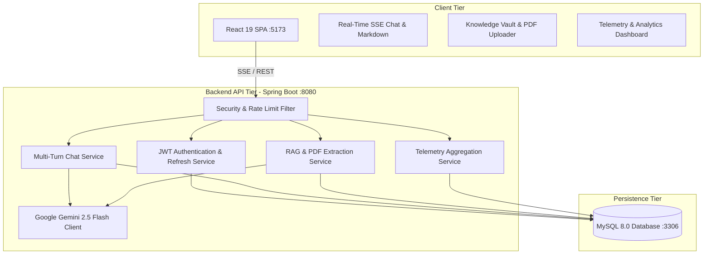

# ⚡ BrainForge AI — Enterprise Knowledge & RAG Platform

> **An advanced, full-stack AI knowledge management platform powered by Spring Boot 4.x, React 19, Google Gemini 2.5 Flash, and Retrieval-Augmented Generation (RAG).**

---

## 🌟 Key Features

* 💬 **Real-time Conversational AI & SSE Streaming**: Multi-turn chat sessions with live token streaming over Server-Sent Events (SSE), markdown formatting, and syntax-highlighted code blocks.
* 📚 **Document Ingestion & Semantic RAG Engine**: Upload PDFs and text documents into your personal Knowledge Vault. The RAG pipeline automatically chunks, extracts, and semantically ranks relevant passages to ground AI responses in verified facts.
* 📊 **Telemetry & Token Analytics**: User and administrator telemetry dashboards tracking total interactions, document scale, estimated tokens processed, and platform activity streams.
* 🔒 **Enterprise-Grade Security & Auth**: Stateless JWT authentication, 7-day database-backed refresh tokens with revocation support, BCrypt password hashing, and in-memory rate limiting against API abuse.
* 🗄️ **Curated Q&A Knowledge Archive**: Preserved and dedicated CRUD management for verified, high-value question and answer pairs.
* 🐳 **Containerized & Production Ready**: Multi-stage Dockerfiles and Docker Compose configuration for one-command orchestration of MySQL, Spring Boot Backend, and React Frontend.

---

## 🏗️ Architecture



---

## 🛠️ Tech Stack

| Layer | Technologies |
| :--- | :--- |
| **Frontend** | React 19, Vite, React Router DOM 7, Lucide Icons, React-Markdown, Remark-GFM, Modern CSS |
| **Backend** | Spring Boot 4.x, Java 21, Spring Security, Spring Data JPA / Hibernate, Apache PDFBox 3.x, JJWT 0.12 |
| **AI / LLM** | Google Gemini 2.5 Flash via REST Client (`generativelanguage.googleapis.com`) |
| **Database** | MySQL 8.0 (Relational schema with foreign keys and cascade rules) |
| **DevOps** | Docker, Multi-Stage Dockerfile, Docker Compose, Nginx |

---

## 📡 REST API Reference

### 🔐 Authentication & Users
* `POST /users/registerUser` — Register user (`fullName`, `email`, `password`, `role`)
* `POST /users/login` — Authenticate and receive Access Token + Refresh Token
* `POST /auth/refresh` — Refresh expired JWT access token using valid refresh token
* `POST /auth/logout` — Revoke refresh token

### 💬 Conversational AI & Streaming
* `GET /chat/conversations` — List all user chat threads
* `POST /chat/conversations` — Create a new conversation thread
* `GET /chat/conversations/{id}` — Get full message history for a conversation
* `DELETE /chat/conversations/{id}` — Delete a conversation thread
* `POST /chat/conversations/{id}/messages` — Synchronous message exchange with Gemini
* `GET /chat/conversations/{id}/stream` — Server-Sent Events (SSE) live streaming response

### 📚 Document Ingestion & RAG
* `POST /documents/upload` — Upload and parse a PDF / TXT document into knowledge chunks
* `GET /documents` — List user's uploaded knowledge base documents
* `DELETE /documents/{id}` — Remove document from knowledge base
* `POST /documents/{id}/query` — Ask question grounded strictly within a specific document

### 📊 Analytics & Telemetry
* `GET /analytics/user` — Personal token usage, conversation stats, and activity timeline
* `GET /analytics/admin` — System-wide telemetry (Total users, questions, tokens, queries)

### 🗂️ Curated Q&A (Legacy)
* `POST /questions` — Create a verified Q&A pair
* `GET /questions/my` — Get authenticated user's Q&A records
* `PUT /questions/{id}` — Update a Q&A record
* `DELETE /questions/{id}` — Delete a Q&A record

---

## 🚀 Getting Started

### 1. Prerequisites
* **Java 21 JDK** installed
* **Node.js 20+** installed
* **MySQL 8.0** running locally on port 3306 with database `brainforgeai`
* **Google Gemini API Key** (Get free key from [Google AI Studio](https://aistudio.google.com/))

### 2. Configure Environment Variable (Windows)
```powershell
[System.Environment]::SetEnvironmentVariable("GEMINI_API_KEY", "your_gemini_api_key_here", "User")
```

### 3. Run the Backend
```powershell
cd BrainForgeAI/BrainForgeAI
$env:GEMINI_API_KEY = [System.Environment]::GetEnvironmentVariable("GEMINI_API_KEY", "User")
mvn spring-boot:run
```
* Backend starts at `http://localhost:8080`
* Swagger UI Docs: `http://localhost:8080/swagger-ui.html`

### 4. Run the Frontend
```powershell
cd BrainForgeAI-Frontend
npm run dev
```
* Frontend starts at `http://localhost:5173`

---

## 🐳 Docker Deployment (One-Command)

To run the entire full-stack ecosystem (MySQL + Backend + Frontend) using Docker:

```powershell
# Set your Gemini API key in the environment
$env:GEMINI_API_KEY="your_api_key_here"

# Spin up all containers
docker-compose up --build
```

Access points:
* **Frontend Web App**: `http://localhost:5173`
* **Backend API**: `http://localhost:8080`
* **Database**: `localhost:3306`
